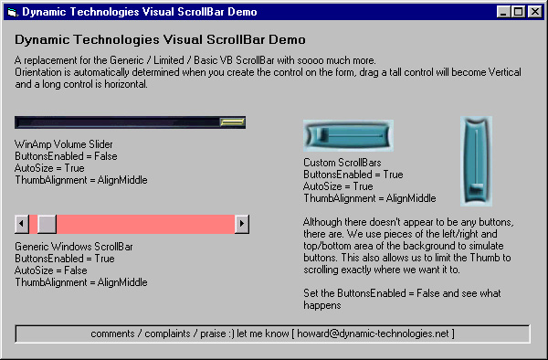



## A Graphical replacement for the Generic / Limited / Basic VB ScrollBar

### Description

NOT just another Scrollbar : 

This control will allow you to use graphics for the background, thumb and the buttons.  

Works in either Horizontal or verticle orientation, will automatically determine the orientation when you create the control on the form.  

Uses Longs for the Min / Max / Value properties, no more 65535 limitation.  

Can AutoSize to the dimensions of the background picture.  

The buttons on the ends can be hidden so only the BackGround and the Thumb are shown.  

Great for use with Skins and other unique grpahical applications. 

No flicker. Smooth scrolling. 

[ Updated ] 
 
### More Info
 

             |
---                |---
**Submitted On**   |2001-04-29 20:00:40
**By**             |[Howard D\. Hull Jr\.](https://github.com/Planet-Source-Code/PSCIndex/blob/master/ByAuthor/howard-d-hull-jr.md)
**Level**          |Advanced
**User Rating**    |4.6 (116 globes from 25 users)
**Compatibility**  |VB 6\.0
**Category**       |[Custom Controls/ Forms/  Menus](https://github.com/Planet-Source-Code/PSCIndex/blob/master/ByCategory/custom-controls-forms-menus__1-4.md)
**World**          |[Visual Basic](https://github.com/Planet-Source-Code/PSCIndex/blob/master/ByWorld/visual-basic.md)
**Archive File**   |[A Graphica189874292001\.zip](https://github.com/Planet-Source-Code/howard-d-hull-jr-a-graphical-replacement-for-the-generic-limited-basic-vb-scrollbar__1-22788/archive/master.zip)

